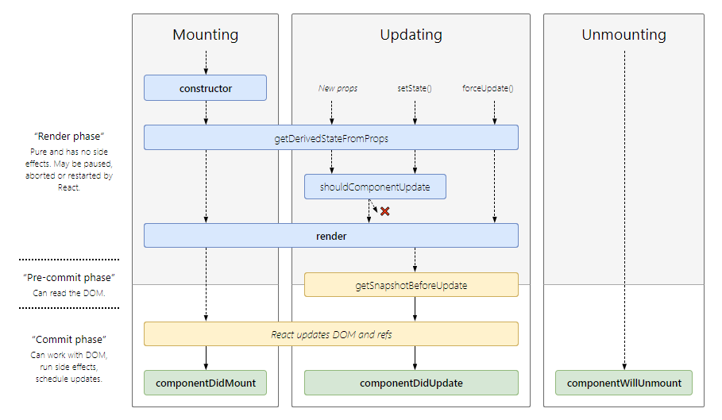
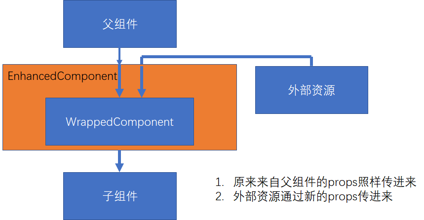
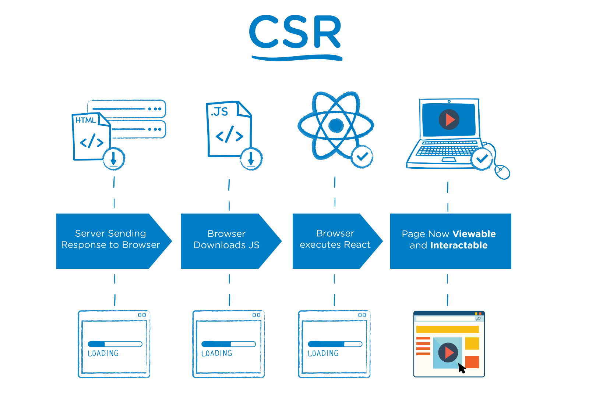
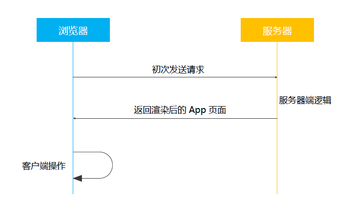

# React 及其生态

## 出现背景及特性

传统的前端开发中，使用 jQuery 进行 UI 的开发。但是，传统的前端开发面临了两个大问题：

1. UI 操作关注了大量细节。jQuery 的 API 众多，直接对 DOM 进行操作，很容易让开发者陷入细节而混淆了总体设计。
2. 应用程序的状态分散的各处，无法追踪和维护。

Facebook 为了解决了两个问题，开发出了 React。React 其实就是一个 View 层，引入了：

1. 1 个新概念： 组件
2. 4 个主要 API:
3. 单向数据流: 引入 Flux 设计方式，简化状态管理
4. 完善的错误提示

## JSX

JSX 不是一种模板语言，是 JavaScript + XML。它允许在 JavaScript 中直接写 HTML 标记 ，可以把它看作是一种语法糖。React 应用通过 Babel 将 JSX 转化为 ES5 的 JavaScript 代码， 改变 DOM。

JSX 语法使用标签元素，如果里面要使用 JavaScript，则在 `{}` 里写 JavaScript 代码。

JSX 的写法主要包括:

1. JSX 本身也是表达式  
   `const element = <h1>Hello, wWrld!</h1>`
2. 在属性中使用表达式  
   `<MyComponent foo={1 + 2 + 3} />`
3. 延展属性

   ```javascript
   const props = { firstName: "Frank", lastName: "Hu" }; // 普通的 JavaScript 代码
   const greeting = <Greeting {...props} />; // JSX
   ```

4. 表达式作为子元素  
   `const element = <li>{props.message}</li>`

**在 JSX 中，小写的 tag 是原生节点，如：`<div>`;大写的 tag 是自定义的组件，如：`<Greeting />`。**

### 在 HTML 中直接使用 JSX

引入脚本：

1. react
2. react-dom
3. babel-cli
4. babel-preset-react-app

### 在脚手架生成的 app 中使用 JSX

用脚手架工具生成 app，然后使用 React 技术。

一般在写 Component 的时候，会使用 JSX 和 ES6 语法，然后使用 Babel 将这些代码转化为浏览器可识别的代码，之后用 Webpack 打包。

这也是 JSX 方式写 Component 一定要引用 react 模块的原因。因为 Babel 将 JSX 转化为 ES5 代码后，转化后代码中会包含 `React.createElement()` 等方法。

```javascript
// JSX 写法创建组件
const element = <h1 className="greeting">Hello, world!</h1>;

// Babel转化后，转化为 ES5
var element = React.createElement(
  "h1",
  { className: "greeting" },
  "Hello, world!"
);

// 运行后产生的 element 对象
const element = {
  type: "h1",
  props: {
    className: "greeting",
    children: "Hello, world!"
  }
};
```

## 元素渲染

JSX 只是生成了一个 React 元素，该元素描述了你在屏幕上想看到的内容。通过 ReactDOM 将 React 元素渲染到浏览器上。

```html
<!-- 真实 DOM 根节点 -->
<div id="root"></div>
```

```javascript
// React 元素
const element = <h1>Hello, world</h1>;

// ReactDOM 负责更新虚拟 DOM，并将虚拟 DOM 映射到真实 DOM 上
ReactDOM.render(element, document.getElementById("root"));
```

## 组件方式(state + props)构建 UI

组件由元素组成，在代码中表现为由 `props` 和 `state` 组成 `view`，可以理解为一个纯函数。

- `props` 是由上层组件(使用者)传递给下层组件的，下层组件不能修改上层组件传给它的`props`，这叫做组件间的单向数据流(注意，`Flux` 单向数据流指的是整个 React 应用的数据流)。
- `state` 表示组件内的状态。

NOTE: `this.setState()`是异步执行的，详情请见 TODO。

组件设计时，推荐的原则有：

1. 让组件无自身 `state`，所需数据从 `props` 获取
2. DRY 原则
3. 单一职责原则

### `函数组件` VS `class 组件` VS `Hook 组件`

1. 函数组件: 只有 props， 无 state

   ```javascript
   function Welcome(props) {
     return <h1>Hello, {props.name}</h1>;
   }
   ```

2. class 组件: 有 props 和 state

   ```javascript
   class Welcome extends React.Component {
     render() {
       return <h1>Hello, {this.props.name}</h1>;
     }
   }
   ```

3. Hook 组件: 有 props 和 state

   ```javascript
   import React, { useState } from "react";

   function Example() {
     // 声明一个叫 “count” 的 state 变量。
     const [count, setCount] = useState(0);

     return (
       <div>
         <p>You clicked {count} times</p>
         <button onClick={() => setCount(count + 1)}>Click me</button>
       </div>
     );
   }
   ```

### 受控组件（推荐使用） VS 非受控组件

form 表单相关的元素(主要有`input`/`textarea`/`select`)比较特殊，在 React 中由两种设计思路：

1. 受控组件  
   受控组件的表单元素由使用者维护。

   ```javascript
   // 受控组件<input />
   class NameForm extends React.Component {
     constructor(props) {
       super(props);
       this.state = { value: "" };

       this.handleChange = this.handleChange.bind(this);
       this.handleSubmit = this.handleSubmit.bind(this);
     }

     handleChange(event) {
       this.setState({ value: event.target.value });
     }

     handleSubmit(event) {
       alert("A name was submitted: " + this.state.value);
       event.preventDefault();
     }

     render() {
       return (
         <form onSubmit={this.handleSubmit}>
           <label>
             Name:
             <input
               type="text"
               value={this.state.value}
               onChange={this.handleChange}
             />
           </label>
           <input type="submit" value="Submit" />
         </form>
       );
     }
   }
   ```

2. 非受控组件  
   非受控组件的表单元素由 DOM 维护。

   ```javascript
   // 非受控组件<input />
   class NameForm extends React.Component {
     constructor(props) {
       super(props);
       this.handleSubmit = this.handleSubmit.bind(this);
     }

     handleSubmit(event) {
       alert("A name was submitted: " + this.input.value);
       event.preventDefault();
     }

     render() {
       return (
         <form onSubmit={this.handleSubmit}>
           <label>
             Name:
             <input type="text" ref={input => (this.input = input)} />
           </label>
           <input type="submit" value="Submit" />
         </form>
       );
     }
   }
   ```

## 生命周期



在理解生命周期 Updating 过程时，需要分清:

1. `nextProps` 和 `nextState`
2. `this.props` 和 `this.state`
3. `prevProps` 和 `prevState`

在 React 组件中，我们可以这么考虑。在当前时间，render 以 `this.state.color = "red"` 为基准渲染出了 View。
执行 `this.setState({color:"green"})` 会有如下步骤：

1. 执行 `shouldComponentUpdate(nextProps, nextState)`:  
   `this.state.color = "red"`  
   `nextState.color = "green"`
2. 执行 `render()`:  
   `this.state.color = "green"`
3. 执行 `componentDidUpdate(prevProps, prevState, snapshot)`:  
   `this.state.color = "green"`  
   `prevState.color = "red"`

### `constructor(props)`

主要用途有：

1. 用于初始化内部状态，很少使用。是唯一可以直接修改 `state` 的地方
2. 用于绑定组件事件中的 `this`

### `static getDerivedStateFromProps(props, state)`

1. 当 `state` 需要从 `props` 初始化时使用
2. 尽量不要使用。维护两者状态一致性会增加复杂度
3. 每次 render 都会调用
4. 典型场景：表单控件获取默认值

### `render()`

一个纯函数，根据 `this.props` 和 `this.state` 获取当前的 `view`。

### `componentDidMount()`

1. UI 渲染完成后调用
2. 只执行一次
3. 典型场景: 获取外部资源

### `shouldComponentUpdate(nextProps, nextState)`

如果组件在其他地方执行了`this.setState`，那么，会执行这个步骤里。在执行这个步骤的时候， `nextState` 是 `this.setState` 执行后新的 `state`，但此时， `this.state` 还是原来的，并没有更改。也就是说， `this.state` 是跟 `render()` 同步的，如果 `shouldComponentUpdate(nextProps, nextState)` 返回了 false， 则 `render()` 不执行， `this.state` 还是保留的原来的值。

1. 决定 Virtual DOM 是否要重绘
2. 一般可以由 PureComponent 自动实现
3. 典型场景:性能优化

### `getSnapshotBeforeUpdate(prevProps, prevState)`

1. 在页面渲染到 DOM 前调用， `this.state` 已更新
2. 典型场景: 获取渲染前的 DOM

### `componentDidUpdate(prevProps, prevState, snapshot)`

1. 每次 UI 更新时被调用
2. 典型场景: 页面需要根据 props 变化重新获取数据

### `componentWillUnmount()`

1. 组件移除时被调用
2. 典型场景: 资源释放

## 事件处理

传统的 HTML：

```html
<button onclick="activateLasers()">
  Activate Lasers
</button>
```

React 中事件：

```javascript
<button onClick={activateLasers}>Activate Lasers</button>
```

如果是 class 组件，在事件处理时，需要正确处理`this`的引用。主要有 3 种方式：

1. bind

   ```javascript
   class Toggle extends React.Component {
     constructor(props) {
       super(props);
       this.state = { isToggleOn: true };

       // 为了在回调中使用 `this`，这个绑定是必不可少的
       this.handleClick = this.handleClick.bind(this);
     }

     handleClick() {
       this.setState(state => ({
         isToggleOn: !state.isToggleOn
       }));
     }

     render() {
       return (
         <button onClick={this.handleClick}>
           {this.state.isToggleOn ? "ON" : "OFF"}
         </button>
       );
     }
   }
   ```

2. public class filed 语法

   ```javascript
   class LoggingButton extends React.Component {
     // 此语法确保 `handleClick` 内的 `this` 已被绑定。
     // 注意: 这是 *实验性* 语法。
     handleClick = () => {
       console.log("this is:", this);
     };

     render() {
       return <button onClick={this.handleClick}>Click me</button>;
     }
   }
   ```

3. 箭头函数(不推荐，每次渲染组件时，都会创建新的回调函数)

   ```javascript
   class LoggingButton extends React.Component {
     handleClick() {
       console.log("this is:", this);
     }

     render() {
       // 此语法确保 `handleClick` 内的 `this` 已被绑定。
       return <button onClick={e => this.handleClick(e)}>Click me</button>;
     }
   }
   ```

## Virtual DOM 和 key

React 引入了虚拟 DOM 的概念。虚拟 DOM 使用 diff 算法，根据广度优先原则，加快了真实 DOM 的渲染。

key 帮助 React 识别哪些元素改变了，比如被添加或删除。因此应当给数组中的每一个元素赋予一个确定的标识。一个好的经验法则是：在 `map()` 方法中的元素需要设置 key 属性。

在进行 diff 算法运算时，比较虚拟 DOM 的改变：

- 如果当前层级，节点只是修改了前后关系，则根据 key 重新排列节点
- 如果当前层级，节点类型/节点数目进行了改变，则直接将变化了的节点删除，创建新的节点

## 组件复用 - 高阶组件 HOC

HOC 是包裹另一个 React 组件的 React 组件，它接受组件作为参数，返回一个新的组件。

```javascript
hocFactory:: (WrappedComponent: React.Component) => EnhancedComponent: React.Component
```



```javascript
// 定义一个高阶组件。在这个高阶组件中，time 是新传入进原来 WrappedComponent 的 props， {...this.props} 是原来就要传进 WrappedComponent 的 props
import React from "react";

export default function withTimer(WrappedComponent) {
  return class extends React.Component {
    state = { time: new Date() };
    componentDidMount() {
      this.timerID = setInterval(() => this.tick(), 1000);
    }

    componentWillUnmount() {
      clearInterval(this.timerID);
    }

    tick() {
      this.setState({
        time: new Date()
      });
    }
    render() {
      return <WrappedComponent time={this.state.time} {...this.props} />;
    }
  };
}
```

```javascript
// 得到一个EnhancedComponent
import React from "react";
import withTimer from "./withTimer";

class MessageList extends React.PureComponent {
  render() {
    return (
      <ul>
        {this.props.messages.map(msg => (
          <li>{msg}</li>
        ))}
      </ul>
    );
  }
}

export class ChatApp extends React.Component {
  state = {
    messages: [],
    inputMsg: ""
  };

  handleInput = evt => {
    this.setState({
      inputMsg: evt.target.value
    });
  };
  handleSend = () => {
    const text = this.state.inputMsg;
    if (text) {
      const newMessages = [...this.state.messages, text];
      this.setState({
        messages: newMessages,
        inputMsg: ""
      });
    }
  };
  render() {
    return (
      <div>
        <MessageList messages={this.state.messages} />
        <div>
          <input value={this.state.inputMsg} />
          <button onClick={this.handleSend}>Send</button>
        </div>
        <h2>{this.props.time.toLocaleString()}</h2>
      </div>
    );
  }
}

export default withTimer(ChatApp);
```

## 组件复用 - 函数作为子组件

```javascript
// 使用 children 属性，children 接收的是一个函数
class MyComponent extends React.Component {
  render() {
    return <div>{this.props.children("Scuba Steve")}</div>;
  }
}
MyComponent.propTypes = {
  children: React.PropTypes.func.isRequired
};

// 函数作为子组件使用
<MyComponent>{name => <div>{name}</div>}</MyComponent>;
```

## Context API

随着组件层级的递增，如果最下层的组件需要某个 props，但是该 props 来自最上层。为了使最下层获取该 props，我们会在各个中间层也传进去这个 props，中间层只是起到传递作用，不会对这个 props 进行更改。这样会使代码看起来很乱。 Context 提供了另外一种传递数据的方式。 Redux 就采用了这种方式。

```javascript
// 1. Context lets us pass a value deep into the component tree
// without explicitly threading it through every component.
// Create a context for the current theme (with "light" as the default).
const ThemeContext = React.createContext("light");

class App extends React.Component {
  render() {
    // 2. Use a Provider to pass the current theme to the tree below.
    // Any component can read it, no matter how deep it is.
    // In this example, we're passing "dark" as the current value.
    return (
      <ThemeContext.Provider value="dark">
        <Toolbar />
      </ThemeContext.Provider>
    );
  }
}

// A component in the middle doesn't have to
// pass the theme down explicitly anymore.
function Toolbar(props) {
  return (
    <div>
      <ThemedButton />
    </div>
  );
}

class ThemedButton extends React.Component {
  // 3. Assign a contextType to read the current theme context.
  // React will find the closest theme Provider above and use its value.
  // In this example, the current theme is "dark".
  static contextType = ThemeContext;
  render() {
    return <Button theme={this.context} />;
  }
}
```

## 脚手架

- Create-React-App:Facebook 自己出的，是学习 React 比较好用的 CLI，但是没有集成 Redux/React-Router
- Codesandbox：在线的一款快速构建 React 应用
- Rekit：一款在 CRA 基础上增加了 Redux 等功能的 CLI

## 打包和部署

打包的主要目的是将代码编译为浏览器可以识别的代码，同时也起到整合资源和优化代码体积的目的。

一般使用 Webpack 进行打包。在打包时，需要注意：

1. 环境变量的设置
2. 禁用开发时的代码，如 logger 等
3. 设置应用的根路径

## Redux 主要概念

React 解决了组件状态与 DOM 的对应关系问题: `state + props => view`。

Redux 解决了整个应用的状态管理问题。Context API 提出了一种方案，可以不用层层传递 props 到最底层，而通过提供全局的 Context 来提供全局的数据状态。高阶组件也提出一种方式，通过封装，给组件提供额外的 props。Redux 整合了这个思路，通过引入`react-redux`，将 Redux 和 React 整合起来，相当于给 React 组件提供了一个全局可用的 Context，这个 Context 就是 Redux 的 Store。

Redux 相当于给应用中的所有 React 组件增加了一个全局的控制机制，用户通过这个机制控制 Store，所有订阅了 Store 的 React 组件根据 Redux Store State 来更新 DOM。

Redux 的三大特性：

1. 单一数据源，也就是说只有一个 Store
2. 可预测性，`state + action => new state`
3. 纯函数更新，也就是说更新 Store 只能通过 Reducer，Reducer 是纯函数


### 数据流向

1. store.dispatch(action)发起一个 action
2. store 调用 reducer，产生新的 state
3. store 保存新的 state
4. 由于 state 有了更新，执行 subscribe 中的监听函数

### Action

Action 是一个简单对象。当该对象被 Store dispatch 后， Reducers 会根据这个 Action 更新 Store 中的 state。

Action 需要定义 type 属性。

```javascript
{ type: 'ADD_TODO', text: 'Go to swimming pool' }
```

#### Action Creators

顾名思义，是产生 Action 的函数。

```javascript
function addTodo(text) {
  return {
    type: ADD_TODO,
    text
  };
}
```

#### bindActionCreators

产生 Action 后，要将此 Action Dispatch 出去 Reducer 才会去处理该 Action 从而更新 Store 中的 state。为了简便处理产生 Action 和 Dispatch，Redux 提供了 bindActionCreators 来简化这一步骤。bindActionCreators 表示将 Action Creators 产生的 Action Dispatch 出去。

### Reducer

Reducer 是一个纯净函数，输入为旧的 state 和 Action，输出为新的 state。

```javascript
function todoApp(state = initialState, action) {
  switch (action.type) {
    case SET_VISIBILITY_FILTER:
      return Object.assign({}, state, {
        visibilityFilter: action.filter
      });
    case ADD_TODO:
      return Object.assign({}, state, {
        todos: [
          ...state.todos,
          {
            text: action.text,
            completed: false
          }
        ]
      });
    default:
      return state;
  }
}
```

上面的代码中，多个 action.type 混在一起，会造成代码混乱。实际应用中，会将多个 Reducer 根据 type 进行拆分,然后在总的 Reducer 中进行组装。

拆分成多个 Reducers：

```javascript
function todos(state = [], action) {
  switch (action.type) {
    case ADD_TODO:
      return [
        ...state,
        {
          text: action.text,
          completed: false
        }
      ]
    default:
      return state
  }
}
​
function visibilityFilter(state = SHOW_ALL, action) {
  switch (action.type) {
    case SET_VISIBILITY_FILTER:
      return action.filter
    default:
      return state
  }
}
```

将多个 Reducers 统一管理：

```javascript
function todoApp(state = {}, action) {
  return {
    visibilityFilter: visibilityFilter(state.visibilityFilter, action),
    todos: todos(state.todos, action)
  };
}
```

#### combineReducers

Redux 提供了一个 combineReducers 来统领所有 Reducer 。功能与上面代码中的 todoApp 类似。

```javascript
import { combineReducers } from 'redux'
​
const todoApp = combineReducers({
  visibilityFilter,
  todos
})
​
export default todoApp
```

### Store

Store 是存放整个应用状态的地方。

创建方法：

```javascript
import { createStore } from "redux";
import todoApp from "./reducers";
const store = createStore(todoApp);
```

常用方法有：

1. `getState()`: 获取当前 state
2. `dispatch(action)`: 发出一个 action。 Store 自动调用 reducer 更新 state。
3. `subscribe(listener)`:当 state 有更改后，会执行回调函数
4. unsubscribe listener: 通过 `const listener1 = subscribe(listener); listener1();` 实现。

Store 中的 state 的形式为：

```javascript
{
  todos: [{
    text: 'Eat food',
    completed: true
  }, {
    text: 'Exercise',
    completed: false
  }],
  visibilityFilter: 'SHOW_COMPLETED'
}
```

## Redux 与 React 的结合使用

Redux 是不一定要和 React 绑定使用的，它只是状态管理工具。如果需要将 Redux 和 React 结合使用，需要引入 `react-redux` 包。

在 React 中使用 Redux，需要将 React 组件分为展示组件和容器组件。展示组件只负责展示，容器组件负责与 Redux 通信。

Redux 与 React 的结合，主要使用了 Context API 和高阶组件。Context API 提供了全局可用的 Store，高阶组件`connect()(wrappedComponent)`实现了给 WrappedComponent 传递额外 props 的能力。

connect 实现高阶组件：

```javascript
import React from "react";
import { connect } from "react-redux";
import { addTodo } from "../actions";

let AddTodo = ({ dispatch }) => {
  let input;

  return (
    <div>
      <form
        onSubmit={e => {
          e.preventDefault();
          if (!input.value.trim()) {
            return;
          }
          dispatch(addTodo(input.value));
          input.value = "";
        }}
      >
        <input
          ref={node => {
            input = node;
          }}
        />
        <button type="submit">Add Todo</button>
      </form>
    </div>
  );
};
AddTodo = connect()(AddTodo);

export default AddTodo;
```

Provider 提供 Context：

```javascript
import React from "react";
import { render } from "react-dom";
import { Provider } from "react-redux";
import { createStore } from "redux";
import todoApp from "./reducers";
import App from "./components/App";

const store = createStore(todoApp);

render(
  <Provider store={store}>
    <App />
  </Provider>,
  document.getElementById("root")
);
```

## Redux 中的异步 Action

异步 Action 不是特殊的 Action，是多个同步 Action 的组合使用。

中间件(Middleware)会截取异步 Action 并进行特殊处理。

针对异步处理，一般设计步骤包括：

1. 设计 store 的 state
2. 设计 reducer
3. 设计同步 action
4. 设计异步 action(这是唯一一步与原来不一样的)

社区主要有两种解决方案：`redux-thunk` 和 `redux-saga`。

### redux-thunk

redux-thunk 作为 Redux 的中间件，除了能处理同步 Action(Plain Object),还可以处理异步 Action(函数)。

配置 redux-thunk:

```javascript
const middleware = [thunk]; // redux-thunk
if (process.env.NODE_ENV !== "production") {
  middleware.push(createLogger()); // redx-logger
}
const composeEnhancers = window.__REDUX_DEVTOOLS_EXTENSION_COMPOSE__ || compose; // redux dev tool
const store = createStore(
  reducer,
  composeEnhancers(applyMiddleware(...middleware))
);
```

同步 Action：

```javascript
export const selectSubreddit = subreddit => ({
  type: SELECT_SUBREDDIT,
  subreddit
});
```

异步 Action：

```javascript
export const fetchPostsIfNeeded = subreddit => (dispatch, getState) => {
  if (shouldFetchPosts(getState(), subreddit)) {
    return dispatch(fetchPosts(subreddit));
  }
};
```

### redux-saga

// TODO

## Redux 中的 state 是不可变数据

Reducer 在处理过程中，遵循 `state + action => new state` 规则，不会改变原来的 state，只会产生新的 state 替代原来的 state。

有三种操作不可变数据的方法：

1. 原生写法: `{...}` 或 `Object.assign`
2. `immutability-helper`
3. `immer`

   ```javascript
   import produce from "immer";

   const baseState = [
     {
       todo: "Learn typescript",
       done: true
     },
     {
       todo: "Try immer",
       done: false
     }
   ];

   const nextState = produce(baseState, draftState => {
     draftState.push({ todo: "Tweet about it" });
     draftState[1].done = true;
   });
   ```

## React Router 路由

Redux 解决了应用的状态管理问题，React Router **解决了 URL 和组件的对应关系**。

在单页应用中，浏览器是不刷新的，通过 ajax 请求对页面元素进行更新，但是会存在一个问题：由于 URL 是不变的，当我们一步步获得某个应用状态时，如果要将这个状态发给别人看，别人通过你发的 URL 得到的是应用的初始状态。那么如何让别人也能看到这个状态呢？答案是通过路由。当应用的状态与 URL 一一对应，那么我们只要将 URL 发给别人，别人就能看到和我们一样的应用状态了。

### 常用的 React Router component

React Router 是**声明式**的**动态路由**。`react-router-dom` 是实际意义上的标准。主要有三种 component:

- **Router Component**, 会产生 history 对象给下级组件，浏览器在各个 URL 之间跳转不会重新请求服务器的关键。

  - `BrowserRouter`: URL 路由。更改 URL 但不会重新请求页面。当用户刷新浏览器时，要求服务器能响应 URL，不然刷新会有问题。
  - `HashRouter`: Hash 路由。更改 URL 的 hash 值，不会重新请求页面。适用于静态服务器。

- **Route Matching Component**, **Route 一定要放在 Router 里面**。Route 匹配当前浏览器中的 `location.pathname` 和 定义的 `<Route path="/news" component={NewsFeed}/>` 属性中的 `path`属性，如果匹配成功，返回 `NewsFeed` 组件，如果匹配失败，返回 null。可以将 Route 应用于任何想通过 location 展示不同组件的场合。

  - `Route`: 路径匹配时显示对应组件，如果浏览器当前路径有多个 `Route` 匹配，会显示多个匹配的路由

    - Route render methods: 路由匹配成功时，有三种渲染组件的方式(`component`| `render` | `children`)

      ```javascript
      const Home = () => <div>Home</div>;

      const App = () => {
        const someVariable = true;

        return (
          <Switch>
            // component 用于已经定义好了的组件的时候
            <Route exact path="/" component={Home} />
            // render 用于需要额外传递参数给组件的时候
            <Route
              path="/about"
              render={props => <About {...props} extra={someVariable} />}
            />
          </Switch>
        );
      };
      ```

    - Route props: Route 默认传递了三个 props 给被渲染的组件
      - match
      - location
      - history

  - `Switch`: 与 `Route` 类似，但是只显示第一个匹配的路由

    ```javascript
    <Switch>
      <Route exact path="/" component={Home} />
      <Route path="/about" component={About} />
      <Route path="/contact" component={Contact} />
      {/* when none of the above match, <NoMatch> will be rendered */}
      <Route component={NoMatch} />
    </Switch>
    ```

- **Navigation Component**

  - `Link`: 类似于 HTML 中的 `<a>`，用户点击后浏览器跳转到新路径，转到新路径后渲染先路径对应的组件
  - `NavLink`: 在 `Link` 的基础上增加了 active 时候的样式
  - `Redirect`: 浏览器重定向到新路径，转到新路径后渲染新路径对应的组件

### URL 传递参数给组件的步骤

1. 在 `Route` 中声明
   `<Route path="/topic/:topicId" component={Topic} />`
2. 在组件中获取

   ```javascript
   function Topic({ match }) {
     return (
       <div>
         <h3>{match.params.topicId}</h3>
       </div>
     );
   }
   ```

### 路由的嵌套：

由于 React Router 将路由看作了一种 Component，所以 React 中 Component 那一套都可以用于路由上。路由的嵌套就是 Component 的嵌套。

### React Router + React + Redux

`connected-react-router`
// TODO

## Ant Design && Material UI && Semantic UI

// TODO

考虑因素：

1. 组件库是否齐全
2. 样式风格是否符合业务需求
3. API 设计是否便捷和灵活
4. 技术支持是否完善
5. 开发是否活跃

## SSR/CSR

SSR 表示 Server Side Rendering, CSR 表示 Client Side Rendering。




SSR 的主要优点有：

1. 首屏出现时间短。由于是在服务器端渲染好整个 HTML 然后发给客户端，用户不用等待客户端去渲染 React 组件。
2. 方便 SEO。

Next.js 构建 SSR(同构应用)，Create React App 构建 CSR

Next.js 的显示过程：


## Unit test

- Jest: 测试框架
- react-testing-library: 类似于 Enzyme，但是主要基于 DOM
- JS DOM: 浏览器环境的 NodeJS 模拟
- Enzyme: 组件渲染和测试
- nock: 模拟 HTTP 请求
- sinon: 函数模拟和调用跟踪
- istanbul: 代码覆盖率

## 开发工具

- ESLint: 语法检查。在代码中配置并在 VSCode 中安装插件。
- Prettier: 代码格式化。在代码中配置并在 VSCode 中安装插件。
- React DevTool: React 开发工具。浏览器插件。
- Redux DevTool: Redux 开发工具。浏览器插件。

## 理想架构

### 易于开发

1. 开发工具是否完善
2. 生态圈是否繁荣
3. 社区是否活跃

### 易于扩展

1. 增加新功能是否容易
2. 新功能是否会显著增加系统复杂度

### 易于维护

1. 代码是否容易理解
2. 文档是否健全

### 易于测试

1. 功能的分层是否清晰
2. 副作用少
3. 尽量使用纯函数

### 易于构建

1. 使用通用技术和架构
2. 构建工具的选择

## 工具库

- 初始化
  - Yeoman
  - 脚手架
    - create-react-app: 前端渲染，前端路由
    - Next.js: 后端渲染，后端路由
    - Gatsby: 在 CI 中渲染
    - Razzle: 类似于 Next.js
- 开发
  - 包管理
    - npm
  - 编译
    - Babel
  - 打包
    - Webpack
    - Neutrino
    - Parcel
- CI
- 测试
  - ava
  - nyc
- 发布
  - aws-cli
  - nwb

## 选型

- **Boilerplate**: create-react-app (with eject if required)
- Utility: JavaScript ES6 + Lodash
- **Styling**: CSS modules/ CSS in JS
- Requests: axios + fetch
- Higher Order Components: maybe + optional recompose
- **Formatting**: Prettier
- Type Checking: PropTypes
- **State Management**: Redux + (Redux Thunk/Saga)
- **Routing**: React Router
- Authentication: Solution with an own Express/Hapi/Koa Node.js Server with Passport.js
- Database: Solution with an own Express/Hapi/Koa Node.js Server with a SQL or NoSQL Database
- **UI Components**: Semantic UI/ AntD
- Time: moment or date-fns
- **Testing**: Jest with Enzyme
- **Bundle**: Babel + Webpack
- **Deploy**
- HMR

## 工程中常碰到的需求

### 路由管理，只能授权用户访问

// TODO

### 表单实现

// TODO

1. 自己搭还是使用 UI 框架。可以使用 ant design 等 UI 提供的组件。
2. 如何初始化表单值
3. 表单提交后，如何知道是否成功
4. 表单验证，错误处理
5. 动态表单元素
6. 内容动态加载

### 页面与后台数据保持一致

// TODO

1. 当我们刷新页面，此时页面如何得到正确的初始值？
   - 浏览器主动去刷新获取数据
2. 当另一个人修改了数据，页面如何保持更新？
   - 服务器推送新的数据过来
   - 浏览器主动去刷新获取数据

### 实现类似 Facebook 即时通知的功能

// TODO  
[Comet](https://en.wikipedia.org/wiki/Comet_%28programming%29)

### 列表页

- 分页和页面刷新
  - 是前端缓存数据还是实时从后台获取？
  - 合适进行页面刷新？
- 内容搜索
  - 是从缓存中去读取还是实时获得？
- 缓存
  - 保留上一次搜索结果的数据还是保留后台所有数据？

## Hooks

props/state/context(todo)/refs(todo)/lifecycle

Solve Problems:

1. Hard to reuse stateful logic
   - render props(todo)
   - hoc(todo)
   - hooks
2. Hard to understand
   - side effect in lifecycle method
   - class
   - this

有状态的无 UI，有 UI 的无状态

API:

- useState
- useEffect
- useReducer
- useContext

Rules:

1. 只能在函数最外层调用
2. 只能在函数组件中调用
3. 在自定义 Hook 中调用

## 常用的第三方包

- [terser](https://github.com/terser-js/terser): 用于压缩代码
- [babel-cli](https://www.npmjs.com/package/babel-cli)以及[babel-preset-react-app](https://www.npmjs.com/package/babel-preset-react-app): 用于将 JSX 转化为 ES5
- [formik](https://jaredpalmer.com/formik/): form 表单的一种解决方案(TODO)

## 前端项目步骤

1. ES6 代码
2. Babel 转化
3. Webpack 打包
4. Jenkins
5. 部署到 server
